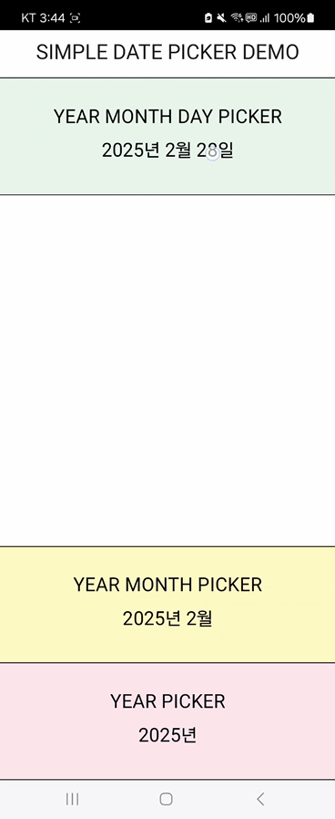

# Simple Date Picker

#### SHOWCASE



#### GETTING STARTED

Run the following command in your terminal to get started

```
 $ flutter pub add simple_date_picker
```

#### USAGE

COMPLETE EXAMPLE is [here](https://github.com/hashtag-mood/simple_date_picker/blob/main/example/lib/main.dart)

<b>*SET UP*</b>

Create an instance of SimpleDatePicker and [Records](https://dart.dev/language/records) for each picker

```
SimpleDatePicker simpleDatePicker = SimpleDatePicker();
(Function, Stream)? yearMonthDayRecord;
(Function, Stream)? yearMonthRecord;
(Function, Stream)? yearRecord;
```

Define each Records by using the method from the simpleDatePicker instance

```
yearMonthDayRecord = simpleDatePicker.yearMonthDayPicker(
      context: context, // required argument
      firstYear: 1950, // initial value: 1900
      lastYear: 2050, // initial value: 2100
      barrierColor: Colors.transparent,
      todayButtonTextStyle: TextStyle(
        color: Colors.black,
      ),
    );
```

<b>*EXAMPLE*</b>

```
GestureDetector(
              onTap: () {
                yearMonthDayRecord?.$1.call(); // Call the picker using Function
              },
              child: StreamBuilder(
                stream: yearMonthDayRecord?.$2, // The stream of the picker
                builder: (context, snapshot) {
                  return Align(
                    alignment: Alignment.center,
                    child: Text(
                      yearMonthDayDateFormat(snapshot.data ?? DateTime.now()),
                      style: TextStyle(fontSize: 20),
                    ),
                  );
                },
              ),
            ),
```
